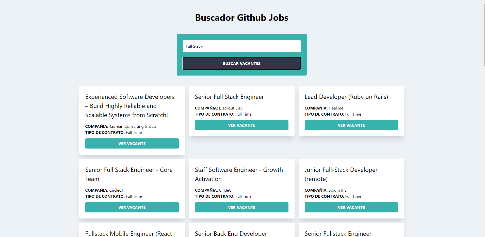

 

  

  <h3 align="center">GithubJobsApp JS</h3>

  

   Aplicación para buscar ofertas de empleo usando la API de GithubJobs
     
     
    <a href="https://apigithubjobsapp-jc.netlify.app/">View Demo</a>
  

  

